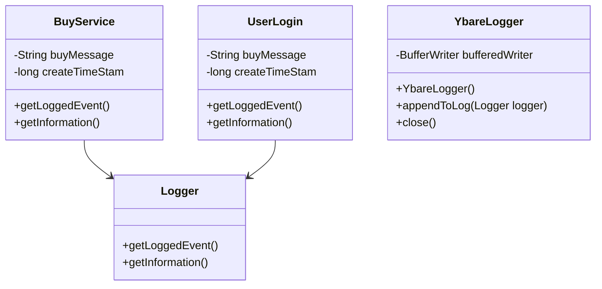

::**CODE**:::

```mermaid
classDiagram

BuyService --> Logger
UserLogin --> Logger

class BuyService{
    -String buyMessage
    -long createTimeStam
    +getLoggedEvent()
    +getInformation()
}

class UserLogin{
    -String buyMessage
    -long createTimeStam
    +getLoggedEvent()
    +getInformation()
}

class Logger{
+getLoggedEvent()
+getInformation()

}

class YbareLogger{
    -BufferWriter bufferedWriter
    +YbareLogger()
    +appendToLog(Logger logger)
    +close()
}


```